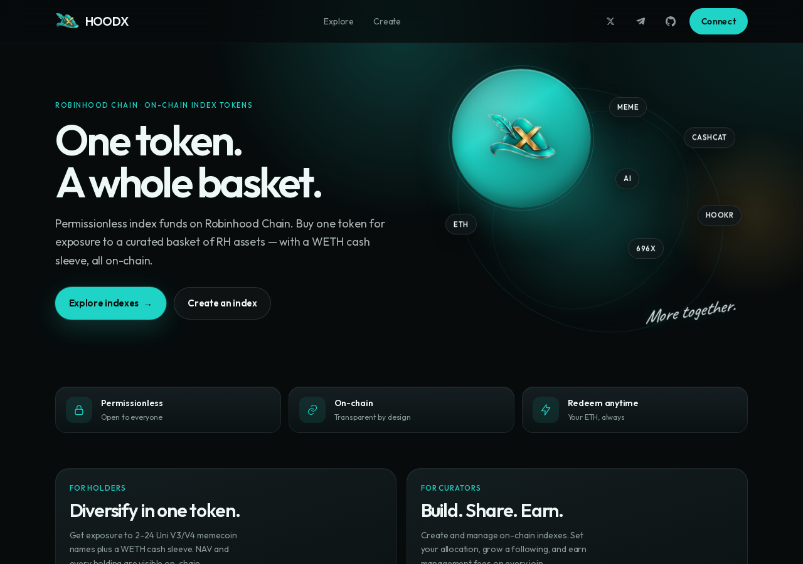
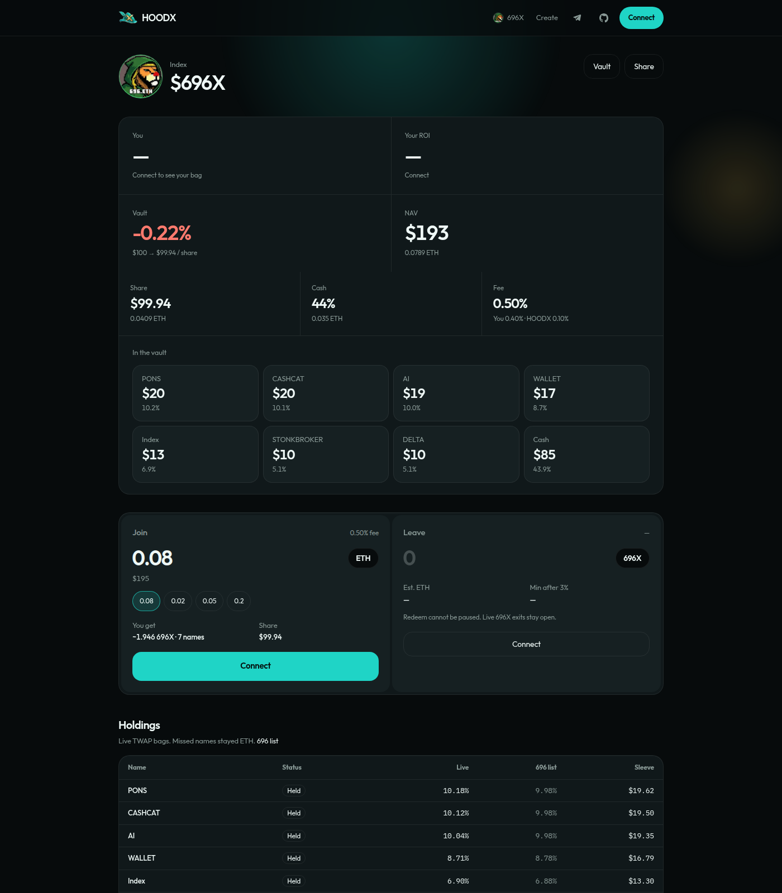

<p align="center">
  
</p>

<h1 align="center">HOODX</h1>

<p align="center">
  <strong>The index factory for Robinhood Chain.</strong><br />
  One token. A whole book.
</p>

<p align="center">
  
  
  
  
</p>

<p align="center">
  <a href="https://www.xhoodindex.com">App</a> ·
  <a href="https://www.xhoodindex.com/i/696x">$696X</a> ·
  <a href="https://x.com/XHOODINDEX">X</a> ·
  <a href="https://t.me/HOODXINDEX">Telegram</a> ·
  <a href="https://x.com/696_eth/status/2100067116594725086">696 list</a> ·
  <a href="https://robinhoodchain.blockscout.com/address/0x6350f9e8e630785ABF09fD1127366998Ad821E33">Vault</a> ·
  <a href="https://robinhoodchain.blockscout.com/address/0x3860176e3cEd09519C377FFc9eDC8379aC4DDf71">Factory</a>
</p>

<p align="center">
  
</p>

HOODX is live on **Robinhood Chain (4663)**. Anyone can mint a trustless meme basket — 2 to 24 Uniswap V3 WETH/USDG or V4 ETH/stock-quote names — as a single ERC-20. Friends send ETH. The vault buys the book. They hold one token, not a folder of airdrops.

You drop `/i/yourslug`. You keep the book from going thin. You earn a cut on every join. **Redeem is free, and it cannot be paused.**

---

## $696X is live

**$696X** is index zero: [696_eth’s RH watchlist](https://x.com/696_eth/status/2100067116594725086) as one bag. The HUD carries 696’s X picture. One share starts at **$100 of ETH**. Join buys the mix. Leave sells your slice back to ETH.

<p align="center">
  
</p>

| | On-chain now |
|---|---|
| Vault | [`0x6350f9e8e630785ABF09fD1127366998Ad821E33`](https://robinhoodchain.blockscout.com/address/0x6350f9e8e630785ABF09fD1127366998Ad821E33) |
| Status | **Live** · joins open · redeem open |
| Share | ~0.04 ETH · genesis peg **$100** of ETH |
| Book | 14 listed names · PROMETHEUS on SPCX V4 · Uni V3 TWAP + V4 spot · ~25%+ WETH cash |
| Fees | 0.50% in · **0% out** |
| First mint | Done (0.13 ETH). Later joins copy the live mix. |
| Token image | On-chain `imageURI` / ERC-7572 `contractURI` · 696 PFP |

Telegram: [t.me/HOODXINDEX](https://t.me/HOODXINDEX)

---

## Compose. Share. Earn.

<table>
  <tr>
    <td width="33%" valign="top">
      <h3>01 · Compose</h3>
      <p>Pick 2–24 RH names with a Uni V3 WETH/USDG or V4 ETH/stock-quote pool. Paste any <code>0x</code> the HUD can price. Names too small stay ETH.</p>
    </td>
    <td width="33%" valign="top">
      <h3>02 · Share</h3>
      <p>Every index lives at <code>/i/yourslug</code>. Friends ape ETH and receive one ERC-20. You curate. They don’t farm seventeen tickers.</p>
    </td>
    <td width="33%" valign="top">
      <h3>03 · Earn</h3>
      <p><strong>0.40%</strong> to you, <strong>0.10%</strong> to HOODX, on every join. Redeem is 0% and stays open if joins are paused.</p>
    </td>
  </tr>
</table>

```
ETH in ── 0.10% protocol
       ── 0.40% creator
       └── net buys the book (Uni V3 TWAP / V4 ETH, 3% max slip)
              ├── thin names stay WETH
              ├── cash sleeve for exits
              └── Leave sells your slice back to ETH. Fee: 0.
```

| | $696X | Your index |
|---|---|---|
| First mint | 0.08 ETH | 0.02 ETH |
| Share at genesis | $100 of ETH | $100 of ETH |
| Join | 0.50% | 0.10% protocol + 0–0.50% you |
| Redeem | **0% · cannot be paused** | same |
| Book | 2–24 names · curator rebalances | same |
| Add a name | paste any RH `0x` with a V3 WETH or V4 ETH pool | same |

A name that cannot fill inside 3% stays ETH. NAV is **every sleeve plus WETH** — not one pool token standing in for the fund. USD on the HUD is the live ETH tape, never a hardcoded price.

---

## Why a factory, not one token

A single watchlist coin is a fund you have to market forever. The loop that spreads:

**you** pick the pack → drop `/i/yourslug` → friends ape → **you** earn.

$696X is the proof. Then anyone mints their own basket. Creator fees and curation are separate keys: point the cut at 696 without handing add/remove.

`696x` and `hoodx` are reserved.

---

## Create yours

1. Open `/create` or the forge on the home page.
2. Name, ticker, slug. Pick 2–24 names — or paste a token `0x`.
3. Set your cut (0–50 bps). HOODX always takes 10 bps.
4. Mint. Share `/i/yourslug`.

The factory is permissionless. `HoodxFactory.create` is for anyone. `create696x` is Gen-0.

---

## HUD

Next.js 15, viem, no private keys. Uniswap-quiet dark UI. Hat mark, teal `#1fd4c6`, gold `#e0b54a`.

Production: **[www.xhoodindex.com](https://www.xhoodindex.com)** (`xhoodindex.com` redirects there).

| Route | |
|---|---|
| `/` | HOODX · featured $696X · create |
| `/i/696x` | You / ROI / vault / NAV · join · leave · book |
| `/i/[slug]` | any index |
| `/create` | mint |

```bash
cp .env.example .env.local
npm install
npm run dev     # http://127.0.0.1:3100
```

Vercel builds this Next HUD from the repository root. `.env.example` already points at the live factory, $696X vault, and `https://www.xhoodindex.com`. Emptied clone `0xeBFA…5C24` (old factory `0x46ea…`) is ignored even if a stale `NEXT_PUBLIC_*` pin is still on the project.

---

## Contracts

Robinhood Chain **4663**. EIP-1167 clones of `HoodxIndex`.

| | Address |
|---|---|
| **Factory** | [`0x3860176e3cEd09519C377FFc9eDC8379aC4DDf71`](https://robinhoodchain.blockscout.com/address/0x3860176e3cEd09519C377FFc9eDC8379aC4DDf71) |
| Implementation | [`0x21B0aE9ecb112d828C6a66b82FdD413B99e44f19`](https://robinhoodchain.blockscout.com/address/0x21B0aE9ecb112d828C6a66b82FdD413B99e44f19) |
| **$696X vault** | [`0x6350f9e8e630785ABF09fD1127366998Ad821E33`](https://robinhoodchain.blockscout.com/address/0x6350f9e8e630785ABF09fD1127366998Ad821E33) |
| TWAP oracle | [`0x815A0D4909460B29c70868e24831f575cA86F3aD`](https://robinhoodchain.blockscout.com/address/0x815A0D4909460B29c70868e24831f575cA86F3aD) |
| WETH | [`0x0Bd7D308f8E1639FAb988df18A8011f41EAcAD73`](https://robinhoodchain.blockscout.com/address/0x0Bd7D308f8E1639FAb988df18A8011f41EAcAD73) |
| Uni V3 SwapRouter02 | [`0xCaf681a66D020601342297493863E78C959E5cb2`](https://robinhoodchain.blockscout.com/address/0xCaf681a66D020601342297493863E78C959E5cb2) |
| Uni V4 PoolManager | [`0x8366a39CC670B4001A1121B8F6A443A643e40951`](https://robinhoodchain.blockscout.com/address/0x8366a39CC670B4001A1121B8F6A443A643e40951) |

```
contracts/HoodxFactory.sol   permissionless clones · create / create696x · imageURI
contracts/HoodxIndex.sol     ETH in / ETH out vault · deposit · withdraw
contracts/HoodxSwap.sol      swap / bind / quote seeds (delegatecall)
contracts/UniTwap.sol        V3 TWAP + V4 spot oracle
```

- `deposit(minShares)` — 97% of preview. Joins can close; **withdraw ignores pause**.
- `withdraw(shares, minEthOut)` — sells the slice, 3% per swap.
- Two-step `owner` (nominate → Accept). Creator-only fee recipient and bps.
- V3 TWAP + V4 spot (mint uses `max(spot, lastPx)`). `restoreCash` is V3-only.
- Quote bind: V3 WETH, V3 USDG, V4 ETH/WETH, V4 stock quote (PROMETHEUS/SPCX), V4 USDG.
- `imageURI` + ERC-7572 `contractURI` at create; curator can `setImageURI`.

```bash
python3 -m unittest tests.test_weights tests.test_vault
```

Read **[DESIGN.md](DESIGN.md)** for mint math, oracle limits, and the drain catalog.

---

## Guarantees

- **Redeem stays open** if joins are paused. User ETH is not a curator hostage.
- A typo owner (zero, vault, WETH, dead) reverts. The new curator cannot steal the creator cut.
- NAV sums every priced sleeve plus WETH. One dumped pool cannot mint the rest of the book cheap.
- The live $696X clone above is canonical. Do not treat a second 696X deploy as this product.
- DYOR. Not HOOD10. Not a seeded Uni pool yet. Not financial advice.

---

<p align="center">
  <a href="https://t.me/HOODXINDEX"><strong>t.me/HOODXINDEX</strong></a><br />
  <sub>Private repository. All rights reserved.</sub>
</p>
