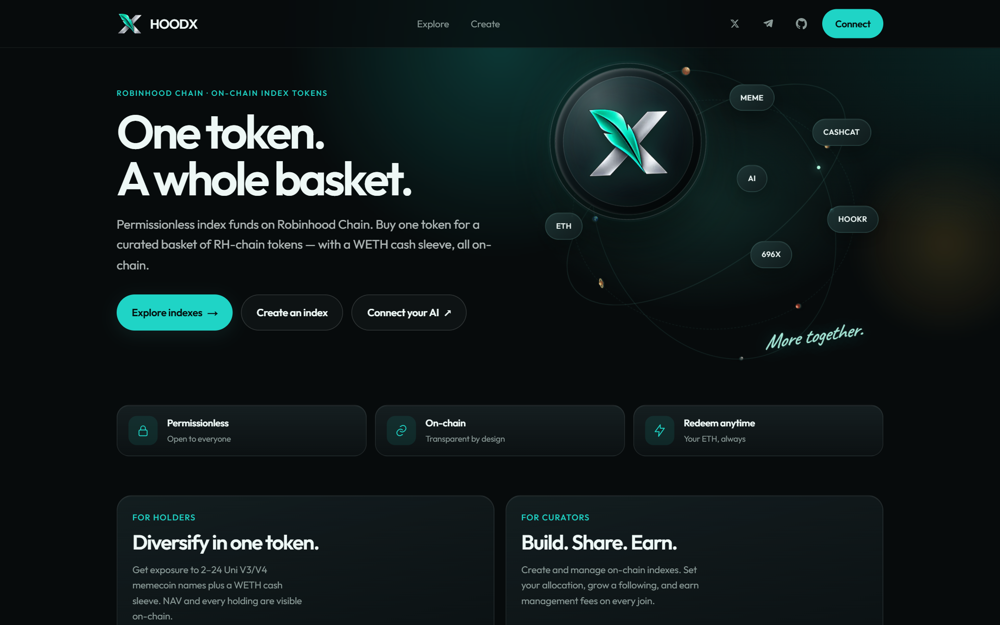
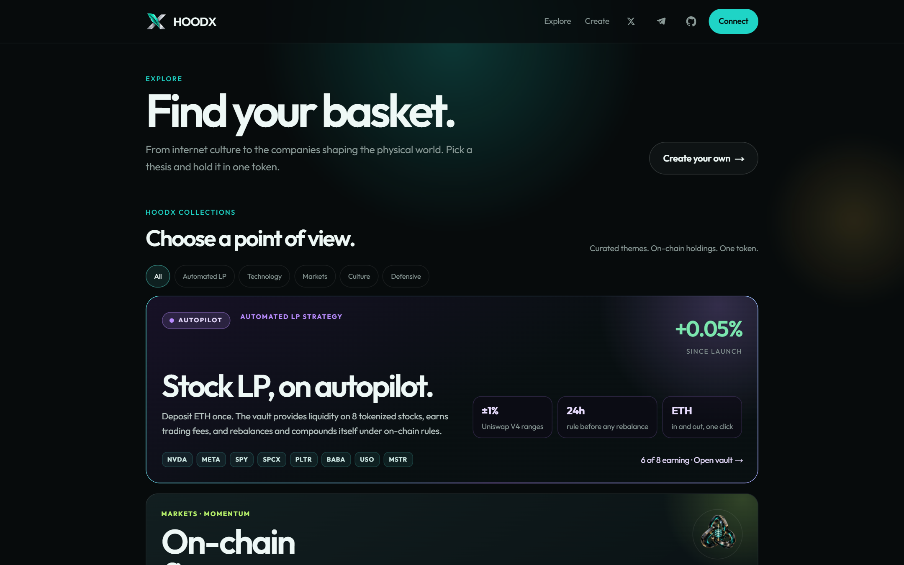
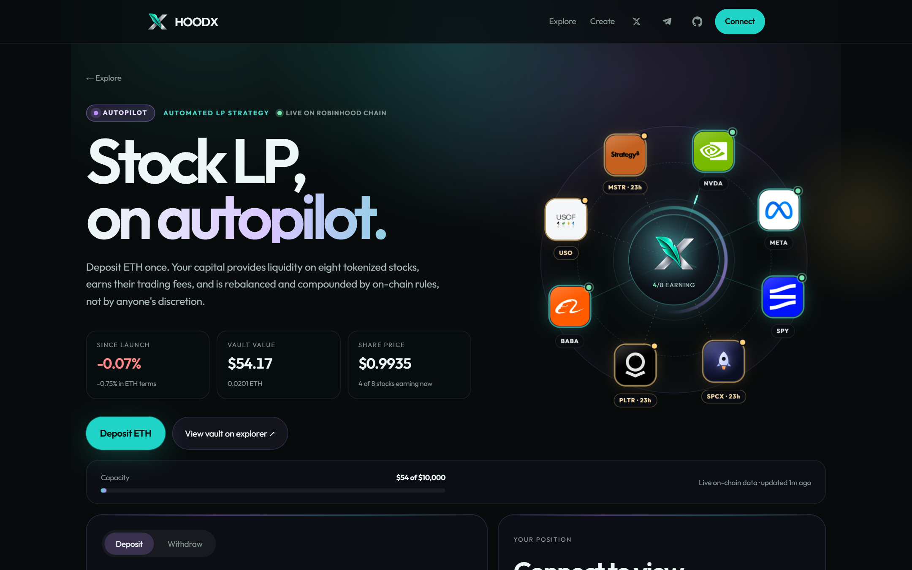

<p align="center">
  
</p>

<h1 align="center">HOODX</h1>

<p align="center">
  <strong>Robinhood Chain · On-chain index tokens · Automated stock LP</strong><br />
  One token. A whole basket.
</p>

<p align="center">
  
  
  
  
  
</p>

<p align="center">
  <a href="https://www.xhoodindex.com">App</a> ·
  <a href="https://www.xhoodindex.com/explore">Explore</a> ·
  <a href="https://www.xhoodindex.com/autolp">Automated LP</a> ·
  <a href="https://www.xhoodindex.com/i/696x">$696X</a> ·
  <a href="https://www.xhoodindex.com/create">Create</a> ·
  <a href="ROADMAP.md">Roadmap</a> ·
  <a href="https://x.com/XHOODINDEX">X</a> ·
  <a href="https://t.me/HOODXINDEX">Telegram</a>
</p>

<p align="center">
  
</p>

HOODX is live on **Robinhood Chain (4663)**:

- **Index tokens.** One ERC-20 holds a curated basket of 2–24 tokenized stocks or RH-chain tokens, plus a WETH cash sleeve. Join with ETH, leave to ETH.
- **Automated LP ($STKX).** One ETH deposit provides Uniswap V4 liquidity on eight tokenized stocks, rebalanced and compounded by on-chain rules.
- **Create your own.** Anyone can mint an index from the factory, share `/i/yourslug` and earn a creator fee on every join.

**Not** Robinhood Markets, **not** tokenized HOOD stock, **not** audited. Source-available experimental software. Verify contracts yourself before joining.

---

## What's live

| Product | Where | Status |
|---|---|---|
| Official indexes (V2) | [/explore](https://www.xhoodindex.com/explore) | 12 deployed · $696X and $FAANGX seeded · 10 awaiting curator seed |
| Automated LP · $STKX | [/autolp](https://www.xhoodindex.com/autolp) | Live · $10 minimum · $10,000 cap · hourly autopilot |
| Create an index | [/create](https://www.xhoodindex.com/create) | Open · permissionless |
| Liquidity Prime · Fee Machine | [/liquidity-prime](https://www.xhoodindex.com/liquidity-prime) · [/fee-machine](https://www.xhoodindex.com/fee-machine) | Pilots |

---

## Explore: pick a point of view

<p align="center">
  
</p>

| Index | Theme | Holdings | Join fee (creator + protocol) | Vault |
|---|---|---|---|---|
| **$696X** | The conviction list (culture) | PONS, AI, CASHCAT, INDEX, MEME, STONKBROKER, HOOKR, DELTA | 0.40% + 0.10% | [`0xb645…9a93`](https://robinhoodchain.blockscout.com/address/0xb645A727ed525321509Ec16aa011D38E52f99a93) |
| **$FAANGX** | Big tech conviction | META, AAPL, AMZN, NFLX, GOOGL | 0% + 0.10% | [`0xcb40…b0b0`](https://robinhoodchain.blockscout.com/address/0xcb40b8d79ff6f4c5db15bd8a9692b934b52cb0b0) |
| $CHAINX | On-chain finance | MSTR, COIN, CRCL, GLXY | 0.40% + 0.10% | [`0xF77f…43d2`](https://robinhoodchain.blockscout.com/address/0xF77fb0e5cE0682B8D8064e754cF99d7F3EC643d2) |
| $CHIPX | Silicon stack | NVDA, AMD, INTC, TSM, MU, AVGO | 0.40% + 0.10% | [`0xb70d…BBE`](https://robinhoodchain.blockscout.com/address/0xb70dD77B61ad2d2D70d14d1e74591fd173f2FBBE) |
| $AIX | AI stack | NVDA, META, PLTR, MSFT, GOOGL | 0.40% + 0.10% | [`0x5B0a…82E7`](https://robinhoodchain.blockscout.com/address/0x5B0a7D7e596fc7E627716945644B3cEe738c82E7) |
| $CULTX | Retail pulse | GME, AMC, RDDT, DJT, BB, RBLX | 0.40% + 0.10% | [`0xB8C2…052b`](https://robinhoodchain.blockscout.com/address/0xB8C2F95238A9076E73D60273C22724360a7A052b) |
| $HLTHX | Health frontier | MRNA, LLY, HIMS, PFE, JNJ | 0.40% + 0.10% | [`0x8b53…0166`](https://robinhoodchain.blockscout.com/address/0x8b53F25665e0fE8A860A1120A0A08d0007570166) |
| $CLOUDX | Cloud layer | SHOP, NET, SNOW, ORCL, MSFT | 0.40% + 0.10% | [`0x649b…a3ec`](https://robinhoodchain.blockscout.com/address/0x649be0E6396778Cf58cd5bdfD347cbe83508a3ec) |
| $REALX | Real assets | GLD, SLV, USO, USAR | 0.40% + 0.10% | [`0x1a39…f1b9`](https://robinhoodchain.blockscout.com/address/0x1a396BfE4f79b1d12a27524217C4DED677BEF1b9) |
| $COREX | Core & carry | SPY, QQQ, SGOV, GLD, VTI | 0.40% + 0.10% | [`0xD6b3…6789`](https://robinhoodchain.blockscout.com/address/0xD6b3ba50aFf684df5B53bAD77CA697F64F076789) |
| $EDGE | Frontier systems | SPCX, TSLA, BA, LMT, RCAT, USAR | 0.40% + 0.10% | [`0xaabF…3AdC`](https://robinhoodchain.blockscout.com/address/0xaabFc490682AD036b421458F10E14dFc105E3AdC) |
| $ICONX | Consumer icons | AAPL, AMZN, COST, META, NFLX, LULU | 0.40% + 0.10% | [`0xba12…bA15`](https://robinhoodchain.blockscout.com/address/0xba12dD90Af13C89662Cb89b85f940c3b8b9bbA15) |

Fees are read from each vault on-chain (`creatorFeeBps`, `protocolFeeBps`). **$696X** and the ten newer collections are proportional vaults from the atomic factory: joins buy your exact slice of every holding and exits sell it, so no price reference can block them. $FAANGX is a V2 vault (below). The previous V2 $696X vault ([`0x5318…9292`](https://robinhoodchain.blockscout.com/address/0x531832cd20d33ee974afee7ba5720b8f3f2c9292)) is retired; any remaining shares redeem in kind. Indexes in plain type have a deployed vault but no curator seed yet, so joins open after the first seed.

**How a V2 index works**

```
ETH in ── protocol fee (≤0.50%) + creator fee (≤0.50%)
       └── net buys the basket through reviewed Uniswap V3 / V4 routes
              ├── ~25% WETH cash sleeve for exits
              └── NAV = every holding valued by its price reference + WETH
Leave ──── sells your slice back to ETH · no exit fee · not blocked by a deposit pause
Redeem in kind ── your share of every token + cash · no prices, no swaps
```

- ETH joins and ETH exits need every holding's on-chain price reference to pass its depth and history checks. If one cannot, the HUD names the asset, and **redeem in kind** stays available.
- Routes and price references are append-only policy approvals. A self-healing controller can switch a token to a curator-pre-approved backup configuration.

---

## Automated LP · $STKX

<p align="center">
  
</p>

Deposit ETH once. The vault splits it across eight Uniswap V4 stock/USDG positions: **NVDA, META, SPY, SPCX, PLTR, BABA, USO, MSTR**.

- Each position sits in a ±1% range around price and earns trading fees while price is inside it.
- **Autopilot:** harvest, compound, out-of-range signal and reband are permissionless cranks with on-chain rules:
  - a position must be out of range for 24 hours before it is rebanded;
  - each reband has a 1-hour cooldown;
  - TWAP and spot prices must agree within 150 bp.
- A stateless keeper runs the cranks hourly from GitHub Actions. Anyone else may run them too.
- **Exit** to ETH in one transaction, or take the emergency exit straight to the underlying sleeve shares.
- **Fees:** 10% performance fee on LP trading fees only. There is no deposit fee and no management fee.
- **Limits:** $10 minimum deposit, $10,000 TVL cap.

| Contract | Address | Verified |
|---|---|---|
| **$STKX vault** | [`0x67D2327eA0C42Cf92C4601ebc59df0F3e9b2aa80`](https://robinhoodchain.blockscout.com/address/0x67D2327eA0C42Cf92C4601ebc59df0F3e9b2aa80?tab=contract) | Blockscout ✓ · Sourcify exact match |
| **Autopilot controller** | [`0x269c6ECac6ACdD8d13b748B14ee8F76CdeD26585`](https://robinhoodchain.blockscout.com/address/0x269c6ECac6ACdD8d13b748B14ee8F76CdeD26585?tab=contract) | Blockscout ✓ · Sourcify exact match |
| Seeder | [`0xd026b1bf94d63bac3e3c9ee55efb427ce4fdc4ee`](https://robinhoodchain.blockscout.com/address/0xd026b1bf94d63bac3e3c9ee55efb427ce4fdc4ee?tab=contract) | Sourcify exact match |
| Sleeves | NVDA [`0xaace…1ab3`](https://robinhoodchain.blockscout.com/address/0xaacee71743b165da07cb67e1516b0303c2be1ab3) · META [`0x5dc5…1b50`](https://robinhoodchain.blockscout.com/address/0x5dc58931df2751096a2a1592cdc7ce9673461b50) · SPY [`0x8459…6c4e`](https://robinhoodchain.blockscout.com/address/0x8459ebe7b2a8628410f2a15bc3f6487263516c4e) · SPCX [`0xc1bc…d09d`](https://robinhoodchain.blockscout.com/address/0xc1bc64d2af27cfe28c084e0530a2fad91ed9d09d) · PLTR [`0x5087…24d0`](https://robinhoodchain.blockscout.com/address/0x5087b8f98e317a1167085f9c1f709e05fb5224d0) · BABA [`0xc261…800b`](https://robinhoodchain.blockscout.com/address/0xc2610f562d9a6ec34114c9dcb6938273604c800b) · USO [`0x3fa2…0c8e`](https://robinhoodchain.blockscout.com/address/0x3fa2da43694934e1cb87f1de8415d8cc09ea0c8e) · MSTR [`0x99aa…7303`](https://robinhoodchain.blockscout.com/address/0x99aa2a30571994eedb614dec0932a68a6ee77303) | Sourcify exact match |

Curator and fee recipient: [`0x134D…37C6`](https://robinhoodchain.blockscout.com/address/0x134D468B0bcaeA6DF127916f951F7938c06A37C6). The curator can pause autopilot management and rescue unrelated tokens sent by mistake. Rescue is hard-coded to refuse USDG, the stock tokens and sleeve shares, so it cannot take depositor positions. See [deployments/stock-lp-vault-v2-live.json](deployments/stock-lp-vault-v2-live.json) for the full deployment record and [docs/VERIFY.md](docs/VERIFY.md) for verification.

---

## Compose. Share. Earn.

<table>
  <tr>
    <td width="33%" valign="top">
      <h3>01 · Compose</h3>
      <p>Pick 2–24 RH names with a reviewed Uni V3 or hookless V4 route. Names too thin to price safely are blocked.</p>
    </td>
    <td width="33%" valign="top">
      <h3>02 · Share</h3>
      <p>Every index lives at <code>/i/yourslug</code>. Friends join with ETH and receive one ERC-20.</p>
    </td>
    <td width="33%" valign="top">
      <h3>03 · Earn</h3>
      <p>Set your creator fee (0–0.50%) on every join. Exits carry no fee.</p>
    </td>
  </tr>
</table>

1. Open [/create](https://www.xhoodindex.com/create) or the forge on the home page.
2. Name, ticker, slug. Pick 2–24 names, or paste a token `0x`.
3. Set your cut (0–50 bps).
4. Launch and seed. Share `/i/yourslug`.

`696x` and `hoodx` are reserved slugs.

---

## HUD

Next.js 16, viem, no private keys in the browser. Dark UI in teal `#1fd4c6` and gold `#e0b54a`, with the HOODX X mark.

Production: **[www.xhoodindex.com](https://www.xhoodindex.com)** (`xhoodindex.com` redirects there).

| Route | |
|---|---|
| `/` | Landing · featured indexes · forge |
| `/explore` | All collections, filters by point of view, Automated LP card |
| `/i/[slug]` | Any index: your position, NAV, basket, join, leave, redeem in kind |
| `/autolp` | Automated LP: live NAV and P/L, deposit and withdraw ETH, autopilot status |
| `/create` | Launch an index |

```bash
cp .env.example .env.local
npm install
npm run dev     # http://127.0.0.1:3100
```

Vercel builds the HUD from the repository root. The HUD only serves the addresses in this README; ignore copycat contracts from DMs or random links.

---

## Contracts

Robinhood Chain **4663**. Verify on [robinhoodchain.blockscout.com](https://robinhoodchain.blockscout.com) or [robin.etherscan.io](https://robin.etherscan.io) only. **Verified source ≠ audited.**

**V2 index system (production)**

| | Address |
|---|---|
| Factory | [`0x5e846680bf8d702072b65e1e403d07e5a5f98b90`](https://robinhoodchain.blockscout.com/address/0x5e846680bf8d702072b65e1e403d07e5a5f98b90) |
| Atomic launch factory (create flow) | [`0x29349c79863b58e7ab470865f7c6df0b31dc7c17`](https://robinhoodchain.blockscout.com/address/0x29349c79863b58e7ab470865f7c6df0b31dc7c17) |
| Index implementation | [`0x79439067baf81dc2f43b76c736cd5eb687e7b7ff`](https://robinhoodchain.blockscout.com/address/0x79439067baf81dc2f43b76c736cd5eb687e7b7ff) |
| Policy (route + price-reference approvals) | [`0x8e36fb11545fc1683f35a079d3f9f1a715dbec70`](https://robinhoodchain.blockscout.com/address/0x8e36fb11545fc1683f35a079d3f9f1a715dbec70) |
| Executor | [`0xa3e8761ce43d1a6afc5229d2aa83dcc5e2bbdd62`](https://robinhoodchain.blockscout.com/address/0xa3e8761ce43d1a6afc5229d2aa83dcc5e2bbdd62) |
| Self-healing controller · $696X | [`0x32d806935f5118a60bB90137e699B81a0348e643`](https://robinhoodchain.blockscout.com/address/0x32d806935f5118a60bB90137e699B81a0348e643) |
| Self-healing controller · $FAANGX | [`0xB0Db61D7AeE1714A285e52f92a7b971bf28bc783`](https://robinhoodchain.blockscout.com/address/0xB0Db61D7AeE1714A285e52f92a7b971bf28bc783) |
| WETH | [`0x0Bd7D308f8E1639FAb988df18A8011f41EAcAD73`](https://robinhoodchain.blockscout.com/address/0x0Bd7D308f8E1639FAb988df18A8011f41EAcAD73) |
| USDG | [`0x5fc5360D0400a0Fd4f2af552ADD042D716F1d168`](https://robinhoodchain.blockscout.com/address/0x5fc5360D0400a0Fd4f2af552ADD042D716F1d168) |
| Uni V4 PoolManager | [`0x8366a39CC670B4001A1121B8F6A443A643e40951`](https://robinhoodchain.blockscout.com/address/0x8366a39CC670B4001A1121B8F6A443A643e40951) |

Index vaults are listed under [Explore](#explore-pick-a-point-of-view); Automated LP contracts under [Automated LP](#automated-lp--stkx). Deployment records: [deployments/robinhood-4663-v2.json](deployments/robinhood-4663-v2.json), [deployments/SELF-HEALING-LIVE-RESULTS.md](deployments/SELF-HEALING-LIVE-RESULTS.md).

<details>
<summary><b>Legacy V1 contracts (superseded)</b></summary>

The original Gen-0 system. Kept for holders and history; new joins use V2.

| | Address |
|---|---|
| V1 factory | [`0x56809a2738A23650aF939F73588E72C67CafC19b`](https://robinhoodchain.blockscout.com/address/0x56809a2738A23650aF939F73588E72C67CafC19b) |
| V1 index implementation | [`0x7A5A47022E993401c5C6CFce0208c10fB032025E`](https://robinhoodchain.blockscout.com/address/0x7A5A47022E993401c5C6CFce0208c10fB032025E) |
| V1 swap logic | [`0x2505a3185136cE990077a71c4929a115d9AEDf75`](https://robinhoodchain.blockscout.com/address/0x2505a3185136cE990077a71c4929a115d9AEDf75) |
| V1 $696X vault (EIP-1167 clone) | [`0xAC45f6FffB17645057aa783b72b2Ce78BD7A1a3A`](https://robinhoodchain.blockscout.com/address/0xAC45f6FffB17645057aa783b72b2Ce78BD7A1a3A) |
| V1 TWAP oracle | [`0x815A0D4909460B29c70868e24831f575cA86F3aD`](https://robinhoodchain.blockscout.com/address/0x815A0D4909460B29c70868e24831f575cA86F3aD) |

</details>

```
contracts/v2/HoodxIndexV2.sol                    ETH in / ETH out vault · in-kind redemption
contracts/v2/HoodxFactoryV2.sol                  index factory
contracts/v2/HoodxPolicyV2.sol                   append-only route + price-reference approvals
contracts/v2/HoodxSelfHealingControllerV2.sol    curator-approved config recovery
contracts/v2/HoodxTwapV2.sol                     V3 TWAP reference with depth/history guards
contracts/liquidity/v4/HoodxStockLpVaultV1.sol   $STKX vault (ETH in/out across sleeves)
contracts/liquidity/v4/HoodxStockLpSleeveV2.sol  one Uniswap V4 stock/USDG range position
contracts/liquidity/v4/HoodxStockLpControllerV2.sol  autopilot rules (harvest/compound/signal/reband)
```

Read **[docs/V2_ARCHITECTURE.md](docs/V2_ARCHITECTURE.md)**, **[docs/V2_SECURITY.md](docs/V2_SECURITY.md)** and **[docs/VERIFY.md](docs/VERIFY.md)**.

---

## Guarantees

- **Exits stay open.** A V2 deposit pause does not block withdrawals, and in-kind redemption never needs prices or swaps.
- NAV sums every priced holding plus WETH, so one dumped pool cannot mint the rest of the basket cheap.
- Price references are immutable and depth-guarded. If one fails its checks, joins and ETH exits fail closed instead of mispricing.
- Automated LP rules are on-chain: no one can reband early, skip the 24-hour out-of-range wait, or act on a price that disagrees with its TWAP reference.

## Before you join

| | |
|---|---|
| Official Robinhood product? | **No.** Community protocol on Robinhood Chain |
| Tokenized HOOD stock? | **No.** Different product, same ticker confusion |
| Audited? | **No.** Read the code; assume bugs, basket risk and impermanent loss |
| Basket risk | RH-chain tokens can rug, thin out or go to zero; stock tokens track volatile equities |
| Verify contracts | Only from this README or **xhoodindex.com**, never from Telegram CAs |
| Never | Import a seed phrase, install a random "HOODX wallet", or trust a DM admin |

Not financial advice.

<p align="center">
  <a href="https://t.me/HOODXINDEX"><strong>t.me/HOODXINDEX</strong></a>
</p>
