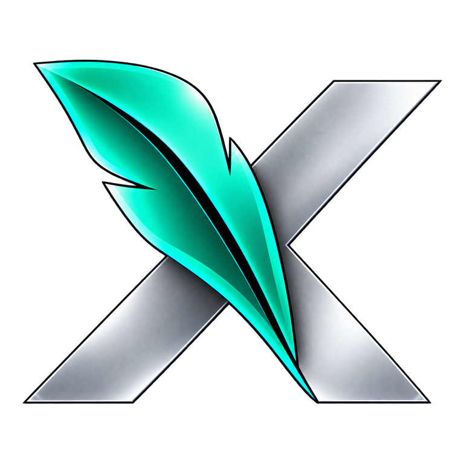
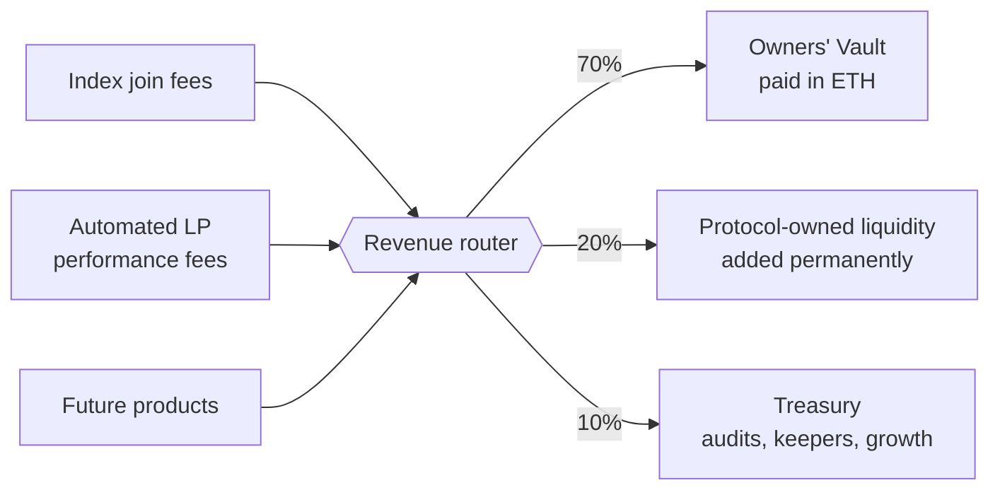

  

<h1 align="center">HOODX Roadmap</h1>

  <strong>One token. A whole basket.</strong> 
  From live index tokens to an owner-run protocol.

  
  
  
  

  <a href="https://www.xhoodindex.com">App</a> ·
  <a href="README.md">README</a> ·
  <a href="docs/VERIFY.md">Verify contracts</a> ·
  <a href="https://x.com/XHOODINDEX">X</a> ·
  <a href="https://t.me/HOODXINDEX">Telegram</a>

---

## How to read this

Everything under **Phase 0** is live on Robinhood Chain today and can be checked on-chain. Everything after it is a plan. Order matters more than dates, and each phase states what must be true before the next one starts.

**The $HIND token launch is the full launch.** Timing depends on market conditions and on the readiness list in Phase 1.

| Phase | Theme | State |
|:---:|---|---|
| **0** | Foundation: indexes, Automated LP, curator tools | **Shipped** |
| **1** | Launch readiness | **In progress** |
| **2** | $HIND token launch | Next |
| **3** | Productive ownership: the Owners' Vault | After launch |
| **4** | Curator economy | After Phase 3 |
| **5** | Liquidity for every index, and beyond | After Phase 4 |

---

## Phase 0 · Foundation

SHIPPED · 16 September – 1 October 2026

**Index tokens**

- [x] **Index vaults.** One ERC-20 holds 2–24 assets plus a WETH cash sleeve. Join with ETH, leave to ETH, or redeem in kind.
- [x] **12 official indexes** deployed across technology, markets, culture and defensive themes. $696X and $FAANGX are seeded.
- [x] **Oracle-free vaults.** Joins buy your exact slice of every holding and exits sell it at live prices, so no price reference can block a deposit or a withdrawal.
- [x] **Permissionless factory.** Anyone can create an index, share `/i/yourslug`, and earn a creator fee of up to 0.50% on joins. Exits carry no fee.

**Automated LP · $STKX**

- [x] **One deposit, eight positions.** ETH in, Uniswap V4 liquidity across eight tokenized stocks.
- [x] **Autopilot on-chain.** Harvest, compound and reband are permissionless, with a 24-hour out-of-range wait, a 1-hour cooldown and a TWAP-versus-spot check.
- [x] **Open keeper.** A stateless keeper runs hourly; anyone else can run it too.

**Curator tools**

- [x] **Curator workspace.** Allocation, one-transaction rebalancing, basket management and protected manual trades.
- [x] **Self-healing routes.** A controller can switch an asset to a pre-approved backup route.
- [x] **Cost basis and performance** for every vault, read from chain history.

**Trust and reach**

- [x] **Verified contracts** on Sourcify and Blockscout, with a public verification guide.
- [x] **An exit on every product** that needs no prices: redeem in kind for indexes, sleeve-share exit for the Automated LP.
- [x] **Explore, share cards and a public token list**, plus machine-readable notes so AI agents can read the protocol.

> **Honest limits today.** No independent audit yet. The Automated LP is capped at $10,000. Ten official indexes are deployed but not yet seeded. Phase 1 exists to close these.

---

## Phase 1 · Launch readiness

IN PROGRESS

The work that makes a token launch responsible rather than early.

- [ ] **Security review.** Independent audit of the oracle-free vault, the factory and the Automated LP. Public report, then a bug bounty.
- [ ] **Key safety.** Curator and admin keys move to a multisig. Parameter changes go through a timelock.
- [ ] **One vault design.** Move $FAANGX to the oracle-free design so every index behaves the same way. Seed the remaining official indexes.
- [ ] **Raise the caps in steps.** Lift the Automated LP cap in published stages, each gated on the previous stage running clean.
- [ ] **Revenue in the open.** A public dashboard showing every fee the protocol earns and where it goes, before any of it is routed to token holders.
- [ ] **Explorer coverage.** Finish verification on every explorer users actually open.

**Done when:** the audit is published, keys sit behind a multisig, the revenue dashboard is live, and all official indexes are seeded.

---

## Phase 2 · $HIND token launch

NEXT · THE FULL LAUNCH

$HIND has one job: connect the people who own HOODX to the revenue the protocol earns.

- **Fair and simple.** Fixed supply. Allocation, the bonus budget and any team vesting are published before launch and enforced by contract.
- **Liquidity first.** The launch pool is seeded as protocol-owned liquidity that is never withdrawn.
- **The revenue router goes live.** Every protocol fee flows into one public contract and is split by fixed, visible rules.
- **No naked staking.** Holding $HIND alone earns nothing. Revenue goes to owners who put the token to work in Phase 3.

### Where the revenue goes

| Share | Goes to | Why |
|:---:|---|---|
| **70%** | Owners' Vault shareholders, paid in ETH | The lion's share goes to the people who own and support the token's market |
| **20%** | Protocol-owned $HIND liquidity, permanently | Every dollar of usage makes the market deeper, for good |
| **10%** | Treasury | Audits, keepers and growth |

**Done when:** $HIND is live, launch liquidity is held as protocol-owned, and the router is receiving real fees.

---

## Phase 3 · Productive ownership: the Owners' Vault

AFTER LAUNCH

Most protocols pay people to lock a token in a box. That rewards idle capital and leaves the token's own market thin. HOODX pays the people who make the market deeper.

**The Owners' Vault** is a curated LP index for $HIND, run by the same autopilot engine as $STKX.

| | |
|---|---|
| **One deposit** | Deposit ETH or $HIND. The vault provides $HIND/ETH liquidity and manages the range for you. You receive one share token. |
| **That share is your eligibility** | Protocol revenue is paid to Owners' Vault shares, not to wallets holding bare $HIND. |
| **No lockups, loyalty instead** | Leave at any time. Your reward weight grows the longer you stay and resets when you exit, so long-term owners out-earn short-term farmers and nobody is trapped. |
| **A rising floor** | The 20% liquidity share is added to the same market permanently. |

**Three sources of yield, all visible on-chain**

1. **Trading fees** from the $HIND/ETH position itself.
2. **Protocol revenue**: 70% of everything the router collects, paid in ETH.
3. **Bonus $HIND** from a fixed, pre-announced budget that declines over time.

**Why this is better for owners.** Revenue is real fees, not emissions. Every eligible owner strengthens the market they depend on. The token cannot be farmed without giving something back.

> **Stated plainly.** An LP position carries price risk and impermanent loss. Revenue depends on protocol usage and can be zero. The vault page will show both.

**Done when:** the Owners' Vault is live and audited, revenue is streaming to shares, and loyalty weighting is running.

---

## Phase 4 · Curator economy

AFTER PHASE 3

Indexes are only as good as the people who run them. This phase gives owners a say in which curators grow, and gives curators a reason to own the protocol.

- **Conviction votes.** Owners' Vault shares vote on which indexes receive bonus $HIND. Curators compete for owners' votes by performing.
- **Curator bonds.** A curator bonds Owners' Vault shares to their index. Bonded indexes earn a badge and rank higher in Explore. The bond stays locked while the index is listed, so curators have skin in the game.
- **Curator rewards.** A share of the protocol fee from an index flows back to its bonded curator, on top of the creator fee.
- **Track records.** Curator profiles with on-chain history: every rebalance, every result, a public leaderboard.
- **Owner perks.** Reduced join fees for Owners' Vault shareholders.

**Done when:** votes direct a live rewards budget and the official indexes are bonded.

---

## Phase 5 · Liquidity for every index, and beyond

AFTER PHASE 4

- **A managed market for every index.** Point the autopilot engine at index tokens themselves, so $696X, $FAANGX and any community index can trade with managed depth. Index holders earn fees on the index they already hold.
- **The flagship index.** An index of HOODX indexes: one token for the whole platform, weighted by conviction votes.
- **Easier ways in.** USDG deposits, recurring deposits, and one portfolio page for everything you hold.
- **Built for agents.** A public API and tool definitions so AI agents can discover indexes, quote a join and hand it to a wallet for signature.
- **Light governance.** Owners vote on router splits and reward budgets inside hard limits written into the contracts. Governance tunes; it cannot seize funds.

---

## Principles

| | |
|---|---|
| **Shipped before promised** | A feature moves to Phase 0 only when it is live and verifiable on-chain. |
| **You can always leave** | Every product keeps an exit that does not depend on prices, keepers or the team. |
| **Revenue, not emissions** | Rewards come from fees first. Bonus tokens are a fixed, declining budget. |
| **Rules on-chain** | Automation runs on published rules anyone can trigger, not on a private bot. |
| **Simple to use** | One deposit, one token, one page. |

---

  
    This roadmap describes intentions, not commitments. Scope, order and token design, including the revenue split, may change for security, legal or market reasons. 
    HOODX is experimental, source-available software. It is not affiliated with Robinhood Markets. Nothing here is financial advice or an offer of any security.
  

